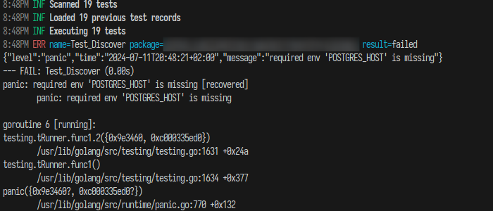

# *GO TEST FAST*
A Golang test execution tool that **prioritizes tests that have failed**. Why run pipelines for several minutes just to reach the test that previously failed?

This tool lists all tests from the given package, prioritizing them in the following order:

1. Tests that have previously failed
2. New tests that were not present in the previous iteration
3. All other tests

<br>

<center>



</center>

## Features

* Colored and human-readable output
* JSON output available for CI
* Caching of previously failing tests for prioritization
* Prioritizes new tests as well
* Coverage support

## Usage

### GO RUN

```
go run github.com/sonalys/gotestfast/entrypoints/gotestfast@latest -help

  -coverprofile string
        If set, writes a coverage profile to the given file
  -input string
        Path to the Go project folder
  -json
        Output test results as JSON
  -output string
        Path to the output file (default "testlog.json")
  -pkg string
        Comma separated list of packages to test (default "./...")
```

### GO INSTALL

`go install github.com/sonalys/gotestfast/entrypoints/gotestfast@latest`

`gotestfast -input PROJECT_DIR -output CACHE_FILE -pkg ./...`

### CI

For CI, please cache the `CACHE_FILE` for the configured `-output` parameter.  
Also, set the `-json` flag for JSON logging.

#### Github Actions

```
- name: Cache dependencies
      uses: actions/cache@v4
      with:
        save-always: true
        path: ~/testlog.json
        key: ${{ runner.os }}-testcache
        restore-keys: |
          ${{ runner.os }}-testcache
```

## Contributions

Any issues or ideas are welcome. Just create a new issue.
